# 禪香不二 Inzense — Odoo 18 香品零售平台使用手冊

> **版本**：Odoo 18 Community | **版本號**：v2.0
> **適用對象**：門市 POS 收銀人員、Portal 會員、後台管理人員
> **最後更新**：2026-06-17
> **維護團隊**：WOOW Tech 沃科技

---

## 目錄

| 編號 | 章節名稱 | 說明 |
|------|---------|------|
| [1](#1-平台總覽與帳號說明) | 平台總覽與帳號說明 | 系統網址、帳號、門市、架構說明 |
| [2](#2-會員登入與註冊) | 會員登入與註冊 | 登入畫面、註冊流程、忘記密碼 |
| [3](#3-會員中心portal-儀表板) | 會員中心（Portal 儀表板） | 儀表板、功能卡片、快速導覽 |
| [4](#4-會員中心--集點卡) | 會員中心 — 集點卡 | 集點卡列表、詳情、歷史紀錄 |
| [5](#5-會員中心--優惠券) | 會員中心 — 優惠券 | 優惠券列表、使用方式 |
| [6](#6-會員中心--禮品卡) | 會員中心 — 禮品卡 | 禮品卡列表、餘額、歷史 |
| [7](#7-會員中心--電子錢包) | 會員中心 — 電子錢包 | 電子錢包餘額、儲值與消費紀錄 |
| [8](#8-我的訂單) | 我的訂單 | 訂單列表、訂單詳情、狀態追蹤 |
| [9](#9-我的發票) | 我的發票 | 發票列表、發票詳情、PDF 下載、線上付款 |
| [10](#10-pos-銷售點--開店與基本操作) | POS 銷售點 — 開店與基本操作 | 開啟收銀機、商品選擇、購物車 |
| [11](#11-pos-銷售點--結帳與付款) | POS 銷售點 — 結帳與付款 | 現金付款、信用卡付款、客戶帳戶付款 |
| [12](#12-pos-銷售點--會員優惠折扣) | POS 銷售點 — 會員優惠折扣 | 集點折抵、優惠券、禮品卡、電子錢包在 POS 使用 |
| [13](#13-pos-銷售點--商品分類與完整商品列表) | POS 銷售點 — 商品分類與完整商品列表 | 19 大分類、293 項商品 |
| [14](#14-pos-銷售點--多門市管理與倉庫隔離) | POS 銷售點 — 多門市管理與倉庫隔離 | 7 間門市 + 1 中央倉庫 |
| [15](#15-pos-銷售點--關店與日結) | POS 銷售點 — 關店與日結 | 關閉收銀機、日結報表 |
| [16](#16-pos-訂單批量匯入) | POS 訂單批量匯入 | 外部平台訂單 CSV/Excel 匯入 |
| [17](#17-銷售訂單批量匯入) | 銷售訂單批量匯入 | 後台銷售訂單 CSV/Excel 匯入 |
| [18](#18-銷售訂單完整流程) | 銷售訂單完整流程 | 建立→確認→出貨→開票→收款 |
| [19](#19-發票管理與銷帳) | 發票管理與銷帳 | 發票過帳、登記付款、銷帳 |
| [20](#20-後台管理--登入與儀表板) | 後台管理 — 登入與儀表板 | 管理員登入、後台導航 |
| [21](#21-後台管理--產品目錄管理) | 後台管理 — 產品目錄管理 | 商品新增、編輯、分類 |
| [22](#22-後台管理--庫存與倉庫管理) | 後台管理 — 庫存與倉庫管理 | 8 倉庫、內部調撥、補貨 |
| [23](#23-後台管理--忠誠計畫管理) | 後台管理 — 忠誠計畫管理 | 集點卡、優惠券、禮品卡、電子錢包、促銷活動 |
| [24](#24-後台管理--客戶與權限管理) | 後台管理 — 客戶與權限管理 | 聯絡人、Portal 權限、使用者管理 |
| [25](#25-後台管理--條碼掃描功能) | 後台管理 — 條碼掃描功能 | 條碼查詢、GS1 解析、標籤列印 |
| [26](#26-行動裝置操作指南) | 行動裝置操作指南 | 手機版 Portal、POS、後台 |
| [27](#27-前台電商網站操作) | 前台電商網站操作 | 首頁、商品瀏覽、購物車、結帳 |
| [28](#28-crm-客戶關係管理) | CRM 客戶關係管理 | 聯絡表單→線索→商機→成交 |
| [29](#29-常見問題faq) | 常見問題（FAQ） | 常見問題與解答 |
| [30](#30-系統管理與維護) | 系統管理與維護 | 備份、更新、安全性 |

---

## 1. 平台總覽與帳號說明

本章說明禪香不二 Inzense Odoo 18 香品零售平台的整體架構。

### 1.1 系統網址一覽

| 系統 | 網址 | 說明 |
|------|------|------|
| 前台電商網站 | https://inzense-odoo.woowtech.io | 商品瀏覽、購物、會員中心 |
| 後台管理介面 | https://inzense-odoo.woowtech.io/web | Odoo 18 後台管理系統入口 |
| 會員中心（Portal） | https://inzense-odoo.woowtech.io/my | 會員自助查詢入口 |
| 會員登入 | https://inzense-odoo.woowtech.io/web/login | 登入頁面 |

### 1.2 帳號與角色

| 帳號 | 密碼 | 姓名 | 角色 | 說明 |
|------|------|------|------|------|
| `fireshadow131@gmail.com` | (同帳號) | 邱豫彥 | 老闆 / 全系統管理 | 後台管理、POS、商品管理 |
| `Petty@sparkledesign.com.tw` | (同帳號) | 李芸珮 | 老闆娘 / 全系統管理 | 後台管理、POS、財務 |
| `service@inzense.com.tw` | (同帳號) | 邱志銘 | 中和廠主管 | 庫存管理、出貨、POS |
| `dusiqian@inzense.com.tw` | (同帳號) | 杜思蒨 | 中和廠員工 | 庫存管理、出貨 |
| `pr@inzense.com.tw` | (同帳號) | 巫詩婷 | 誠品板橋店員工 | POS 收銀、庫存 |
| `admin` | `admin` | 禪香不二 Inzense | 系統管理員 | 開發/維護用 |
| `portal@inzense.com.tw` | `portal` | 禪香不二 展示客戶 | Portal 會員 | 會員中心展示帳號 |

> **安全提醒**：正式上線前請更換所有帳號密碼。

### 1.3 門市與倉庫配置

禪香不二設有 **1 個中央倉庫** + **7 間門市寄賣點**，採用多倉庫隔離架構：

| POS 營業點 | 倉庫代碼 | 倉庫名稱 | 說明 |
|---------|------|---------|------|
| — | 中和 | 中和研發製香廠 | 中央倉庫 / 生產基地 |
| 誠品板橋門市 | 板橋誠品 | 誠品板橋門市倉庫 | 誠品板橋店寄賣 |
| 雲彩軒 | 雲彩軒 | 雲彩軒倉庫 | 寄賣點 |
| 滿滿 | 滿滿 | 滿滿倉庫 | 寄賣點 |
| 黑橋牌戎館 | 黑橋牌 | 黑橋牌戎館倉庫 | 寄賣點 |
| 名品花園 | 名品 | 名品花園倉庫 | 寄賣點 |
| 納百川 | 納百川 | 納百川倉庫 | 寄賣點 |
| 壹品藥局 | 壹品 | 壹品藥局倉庫 | 寄賣點 |

> **補貨機制**：每間門市倉庫均設有從中和研發製香廠自動供應的路線。當門市庫存不足時，可透過內部調撥從中央倉庫補貨。

### 1.4 公司資訊

| 項目 | 內容 |
|------|------|
| 公司名稱 | 禪香不二 Inzense |
| 地址 | 新北市中和區立德街26巷1號樓上 |
| 客服電話 | 0926-926-851 |
| 業務/經銷 | 0911-675-120 |
| 客服信箱 | service@inzense.com.tw |
| 業務合作 | cooperate@inzense.com.tw |
| LINE@ | @209hnrwf |
| 幣別 | 新台幣 TWD（NT$） |
| 語言 | 繁體中文（zh_TW） |
| 時區 | Asia/Taipei |
| 稅務 | 營業稅 5%（銷售）/ 進項稅 5%（進貨） |
| 官方網站 | https://www.inzense.com.tw |

### 1.5 平台架構說明

| 功能模組 | 說明 |
|---------|------|
| 前台電商（Website Sale） | 商品瀏覽、線上購物、會員註冊 |
| 銷售點 POS | 7 間門市寄賣點的零售銷售系統 |
| 銷售管理（Sales） | 後台銷售訂單管理、報價單 |
| 發票管理（Invoicing） | 發票開立、收款、銷帳 |
| 庫存管理（Inventory） | 8 倉庫庫存追蹤、內部調撥 |
| CRM 客戶關係管理 | 聯絡表單→線索→商機管理 |
| 忠誠計畫（Loyalty） | 電子錢包、集點卡、禮品卡、優惠券、促銷活動 |
| 會員中心（Portal） | 會員自助入口，查看訂單、發票、忠誠計畫 |
| 條碼掃描（Barcode） | 商品條碼查詢、GS1 解析、標籤列印 |
| POS 訂單匯入 | 外部平台訂單批量匯入至 POS |
| 銷售訂單匯入 | 批量銷售訂單 CSV/Excel 匯入 |

> **社群連結**：[Facebook @onlyinzense](https://www.facebook.com/onlyinzense) | [Instagram @only_inzense](https://instagram.com/only_inzense) | [LINE@ @209hnrwf](https://lin.ee/Fn75IVT)

---

## 2. 會員登入與註冊

### 2.1 登入頁面

前往 `https://inzense-odoo.woowtech.io/web/login` 進入登入頁面。

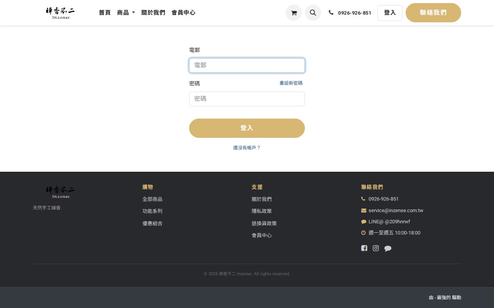

**操作步驟**：

1. **電子信箱**：輸入您的帳號（Email 格式）
2. **密碼**：輸入密碼
3. 點擊 **「登入」** 按鈕

### 2.2 登入後畫面

- **管理員/員工登入**：進入 Odoo 後台管理介面
- **會員登入**：進入會員中心 Portal 儀表板

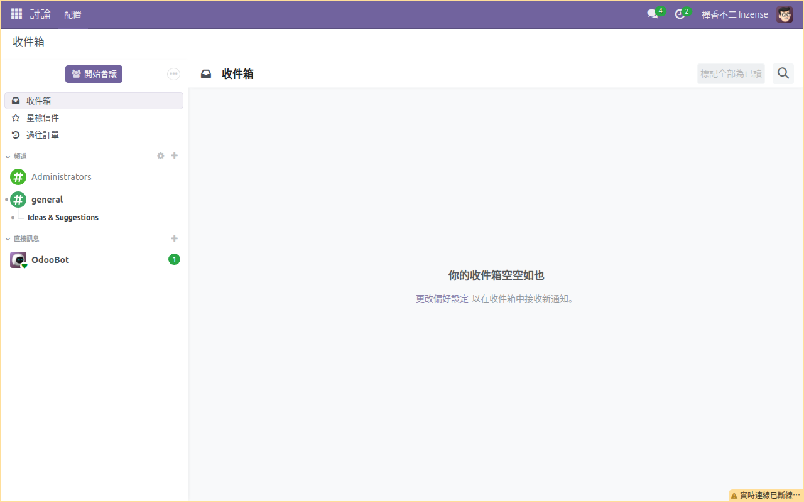

### 2.3 註冊新會員

1. 在登入頁面點擊 **「沒有帳號嗎？」** 連結
2. 填寫姓名、Email、密碼
3. 點擊 **「註冊」**
4. 系統將發送驗證信至您的信箱

### 2.4 忘記密碼

1. 在登入頁面點擊 **「重設密碼」**
2. 輸入註冊時的 Email
3. 系統發送重設連結至信箱
4. 點擊連結設定新密碼

---

## 3. 會員中心（Portal 儀表板）

登入後前往 `/my` 即可進入會員中心。

### 3.1 儀表板總覽

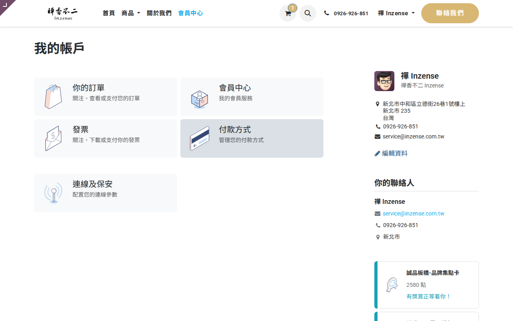

**儀表板完整頁面**：

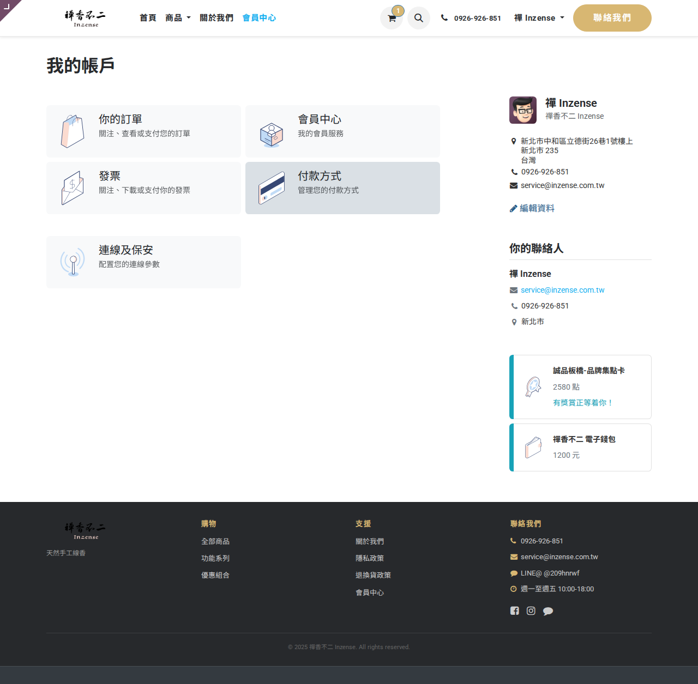

**Portal 首頁**：

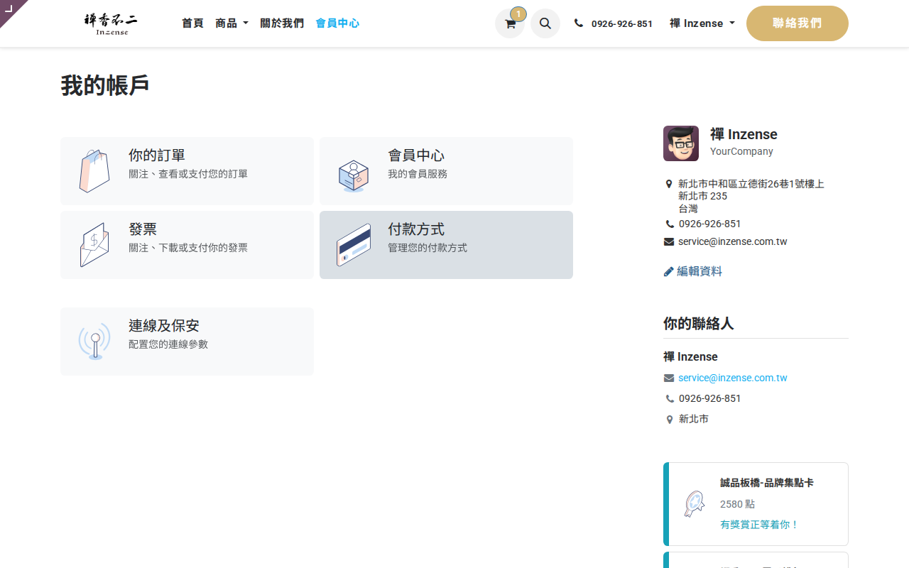


儀表板提供以下快速入口：

| 功能 | 說明 | 路徑 |
|------|------|------|
| 訂單 | 查看所有銷售訂單 | `/my/orders` |
| 發票 | 查看發票與付款狀態 | `/my/invoices` |
| 會員中心 | 集點卡、優惠券、禮品卡、電子錢包 | `/my/member-center` |
| 個人資料 | 修改姓名、Email、密碼 | `/my/account` |
| 安全設定 | 啟用兩步驗證 (2FA) | `/my/security` |

### 3.2 會員中心入口


會員中心整合四大功能：
- **集點卡**：累積消費點數，兌換獎勵
- **優惠券**：折扣券、贈品券、滿額贈
- **禮品卡**：儲值卡片，可用於付款
- **電子錢包**：線上餘額，可用於線上或門市消費

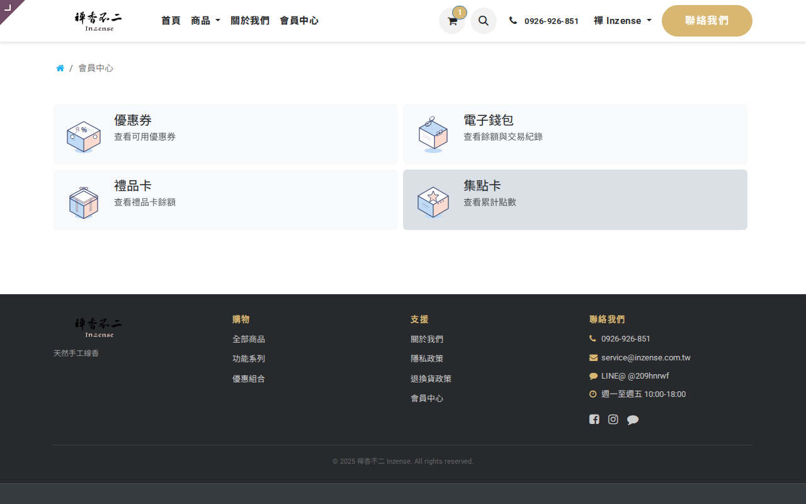

---

## 4. 會員中心 — 集點卡

### 4.1 集點卡列表

前往 `/my/loyalty` 查看集點卡。

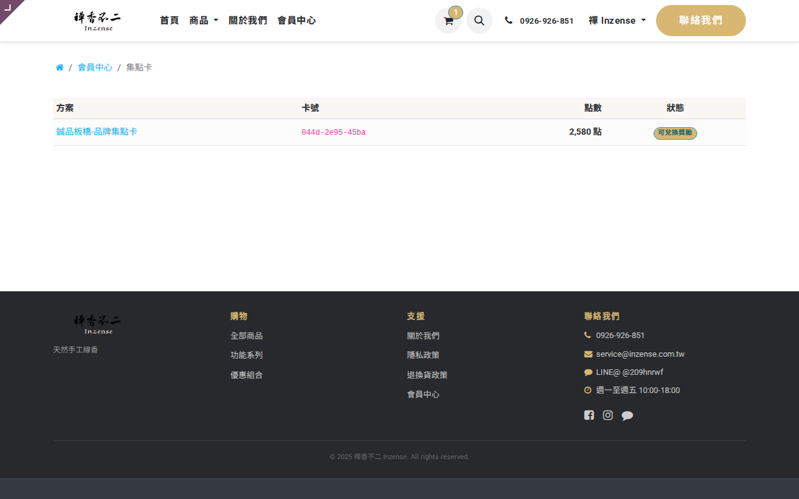

| 欄位 | 說明 |
|------|------|
| 計畫名稱 | 集點卡名稱（如：誠品板橋-品牌集點卡） |
| 點數 | 目前累積點數（以「點」為單位） |
| 代碼 | 集點卡識別碼 |
| 到期日 | 點數有效期限（永久或指定日期） |

### 4.2 如何累積點數

1. 於 POS 門市消費時，收銀人員選擇您的會員帳號
2. 結帳後系統自動依規則累積點數
3. 累積的點數可於下次消費時折抵使用

### 4.3 目前集點方案

| 方案名稱 | 類型 | 點數單位 | 說明 |
|---------|------|---------|------|
| 誠品板橋-品牌集點卡 | 集點 | 點 | 消費累積點數，折抵消費 |

---

## 5. 會員中心 — 優惠券

### 5.1 優惠券列表

前往 `/my/coupon` 查看優惠券。

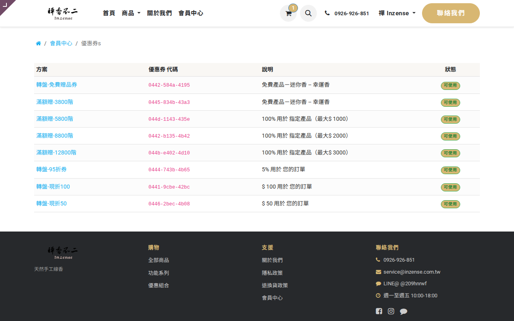

### 5.2 目前優惠券方案

| 優惠券名稱 | 說明 | 使用方式 | 有效期限 |
|---------|------|---------|---------|
| 轉盤-95折券 | 全單 95 折 | 結帳輸入代碼 | 2026-09-15 |
| 轉盤-現折100 | 現折 NT$100 | 結帳輸入代碼 | 2026-09-15 |
| 轉盤-現折50 | 現折 NT$50 | 結帳輸入代碼 | 2026-09-15 |
| 轉盤-免費贈品券 | 免費兌換贈品 | 結帳輸入代碼 | 2026-09-15 |
| 滿額贈-3800階 | 消費滿 NT$3,800 贈品 | 自動套用 | 2026-09-15 |
| 滿額贈-5800階 | 消費滿 NT$5,800 贈品 | 自動套用 | 2026-09-15 |
| 滿額贈-8800階 | 消費滿 NT$8,800 贈品 | 自動套用 | 2026-09-15 |
| 滿額贈-12800階 | 消費滿 NT$12,800 贈品 | 自動套用 | 2026-09-15 |

### 5.3 使用方式

- **POS 門市**：收銀人員在結帳時掃描優惠券代碼或手動輸入
- **線上購物**：在購物車頁面輸入優惠券代碼

---

## 6. 會員中心 — 禮品卡

### 6.1 禮品卡列表

前往 `/my/gift-card` 查看禮品卡。

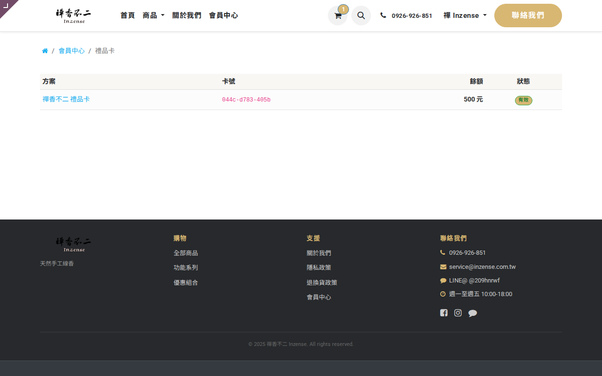

| 欄位 | 說明 |
|------|------|
| 計畫名稱 | 禪香不二 禮品卡 |
| 餘額 | 剩餘可用金額（以「元」為單位，即 NT$） |
| 到期日 | 卡片有效期限 |
| 代碼 | 禮品卡兌換代碼 |

### 6.2 使用方式

1. **POS 門市**：結帳時選擇禮品卡付款 → 輸入代碼 → 自動扣除餘額
2. **線上購物**：結帳時輸入禮品卡代碼

---

## 7. 會員中心 — 電子錢包

### 7.1 電子錢包列表

前往 `/my/ewallet` 查看電子錢包。

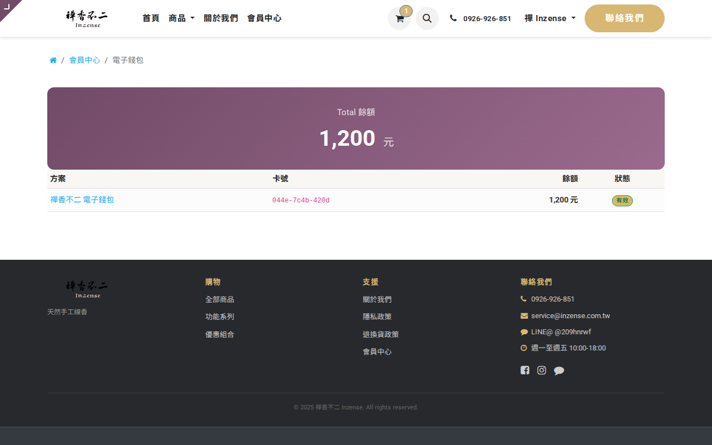

| 欄位 | 說明 |
|------|------|
| 計畫名稱 | 禪香不二 電子錢包 |
| 餘額 | 目前可用餘額（NT$） |
| 代碼 | 錢包識別碼 |
| 歷史紀錄 | 儲值與消費明細 |

### 7.2 使用方式

- 電子錢包可在 POS 門市或線上購物時作為付款方式
- 儲值需由門市人員或管理員在後台操作
- 餘額永久有效（無到期日）

---

## 8. 我的訂單

### 8.1 訂單列表

前往 `/my/orders` 查看所有訂單。

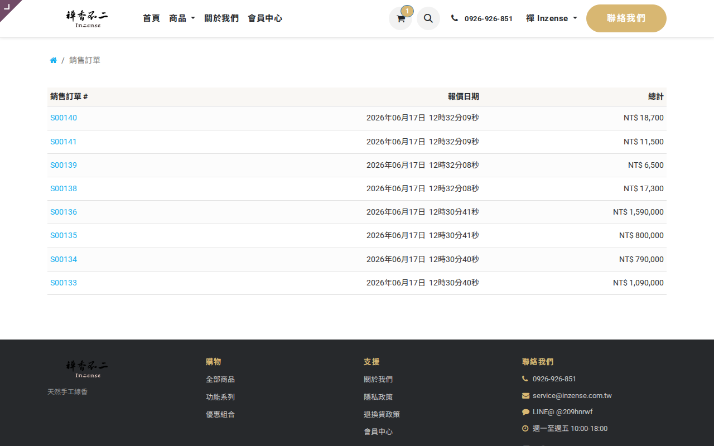

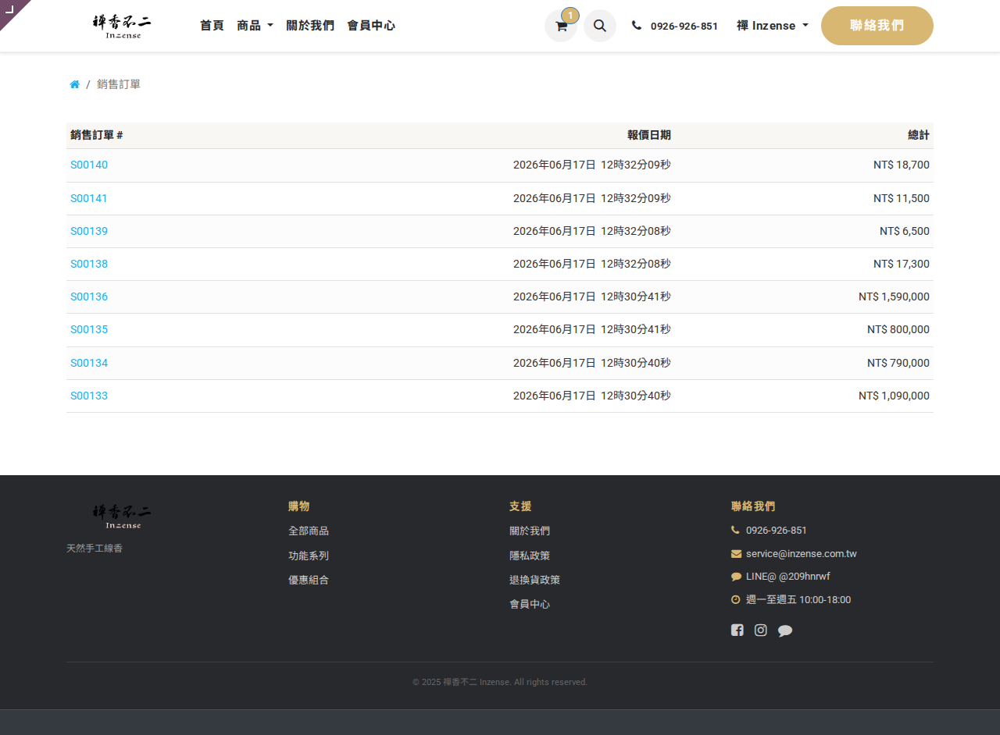

| 欄位 | 說明 |
|------|------|
| 訂單編號 | 如 S00138、S00139 等 |
| 訂單日期 | 下單時間 |
| 金額 | 訂單總金額（NT$） |
| 狀態 | 報價單 / 銷售訂單（已確認） |

### 8.2 訂單詳情

點擊訂單編號可查看明細。

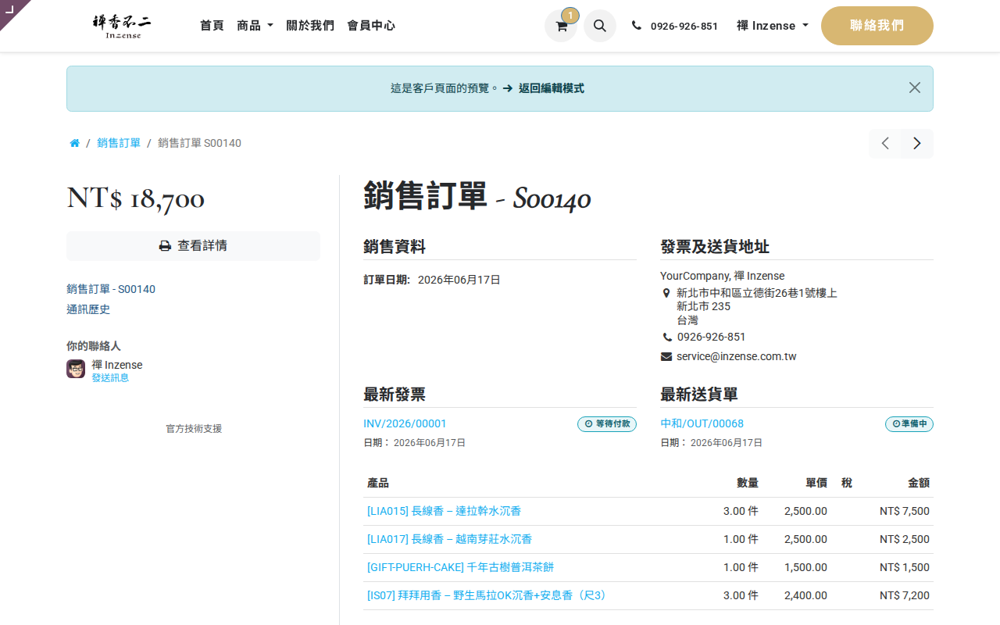

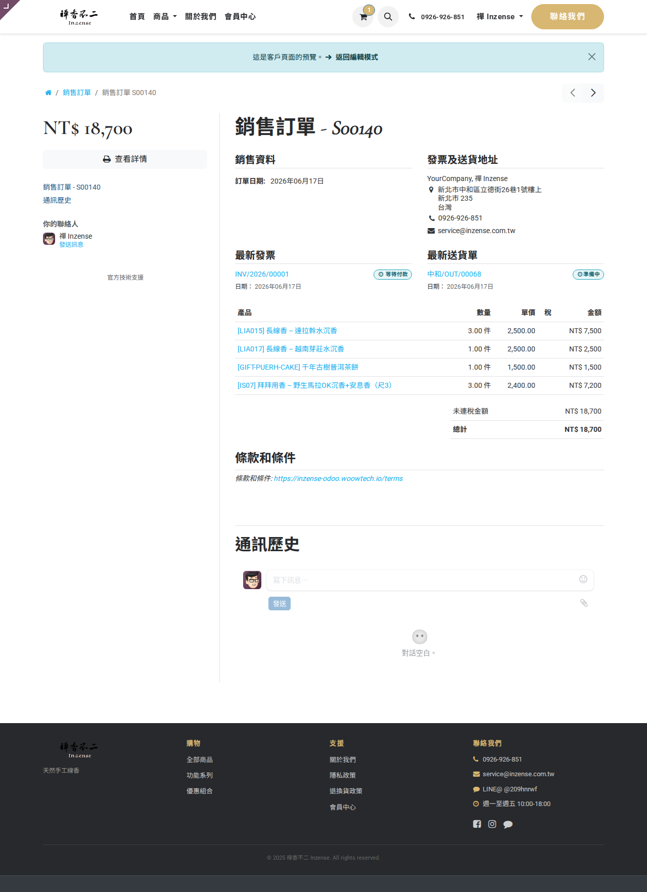

詳情頁包含：
- 訂單明細（商品名稱、數量、單價、小計）
- 訂單狀態與時間線
- 配送資訊（若適用）
- 關聯發票連結

---

## 9. 我的發票

### 9.1 發票列表

前往 `/my/invoices` 查看所有發票。

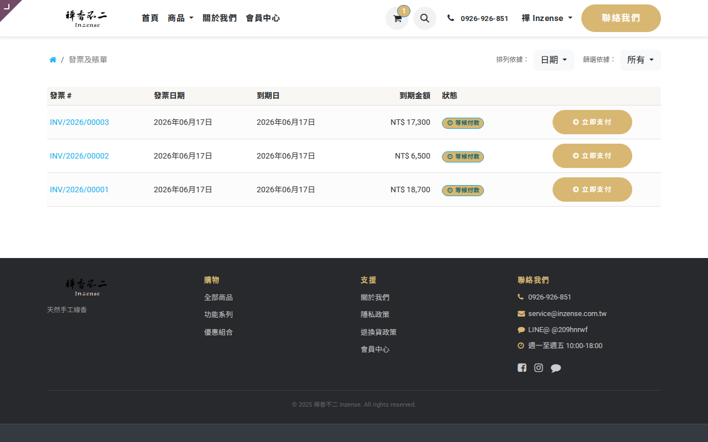

| 欄位 | 說明 |
|------|------|
| 發票編號 | 如 INV/2026/00001 |
| 發票日期 | 開立日期 |
| 金額 | 發票金額（NT$） |
| 狀態 | 草稿 / 已過帳 / 已付款 |

### 9.2 發票詳情

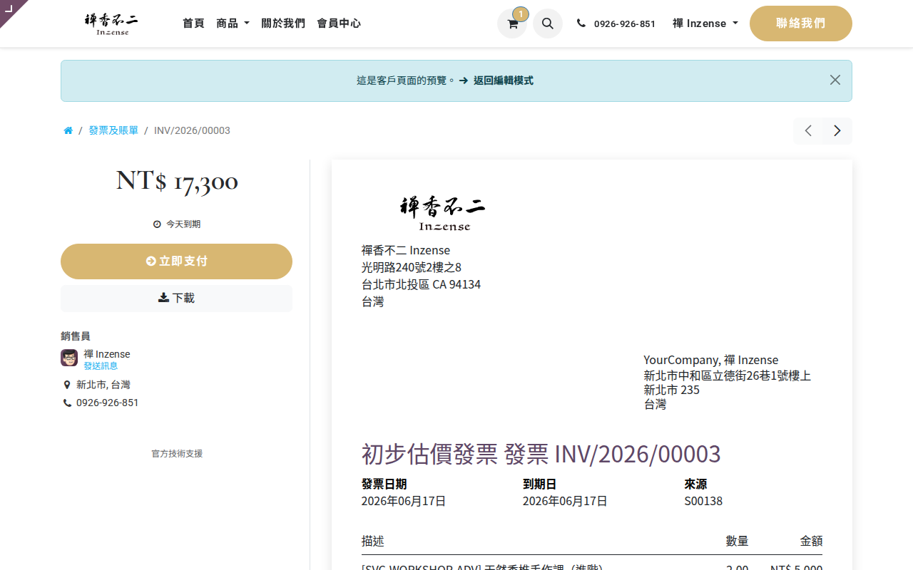

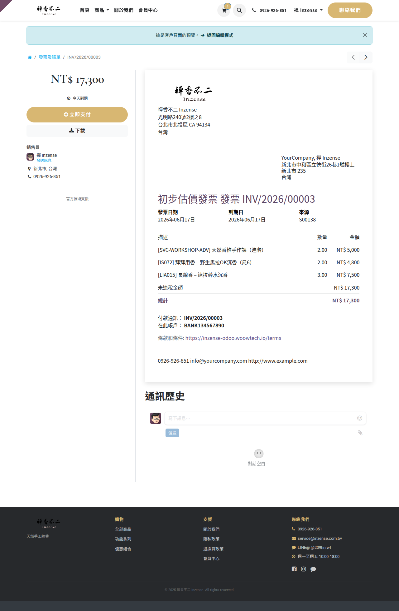

可用功能：
- **下載 PDF**：點擊「列印」按鈕下載發票 PDF
- **線上付款**：若已設定線上付款閘道，可直接付款
- **查看明細**：商品名稱、數量、單價、稅額、總計

---

## 10. POS 銷售點 — 開店與基本操作

### 10.1 選擇門市

登入後台 → 點擊 **「銷售點」** 模組 → 選擇要開啟的門市。


目前 **7 間門市**：

| # | 門市名稱 | 對應倉庫 |
|---|---------|---------|
| 1 | 誠品板橋門市 | 誠品板橋門市倉庫 |
| 2 | 雲彩軒 | 雲彩軒倉庫 |
| 3 | 滿滿 | 滿滿倉庫 |
| 4 | 黑橋牌戎館 | 黑橋牌戎館倉庫 |
| 5 | 名品花園 | 名品花園倉庫 |
| 6 | 納百川 | 納百川倉庫 |
| 7 | 壹品藥局 | 壹品藥局倉庫 |

### 10.2 開啟收銀機

1. 點擊門市名稱旁的 **「開啟」** 按鈕
2. 系統開啟 POS 介面
3. 若啟用現金控管，需輸入開店零用金金額

### 10.3 基本操作流程

1. **選擇商品**：從左側商品列表點選，或使用搜尋欄 / 條碼掃描器
2. **調整數量**：使用數字鍵盤修改數量
3. **指定客戶**：點擊「客戶」按鈕選擇會員帳號（累積點數必須指定客戶）
4. **結帳**：點擊「付款」進入結帳畫面

### 10.4 商品搜尋

- 直接在搜尋欄輸入商品名稱（支援中文搜尋）
- 使用條碼掃描器掃描商品條碼（支援 EAN-13、GS1-128）
- 點擊分類標籤快速篩選（如：功能系列、神明系列等）

---

## 11. POS 銷售點 — 結帳與付款

### 11.1 可用付款方式

| 付款方式 | 說明 | 適用場景 |
|---------|------|---------|
| 禪香不二 現金 | 現金收款，自動計算找零 | 所有門市 |
| 禪香不二 信用卡 | 信用卡/行動支付 | 所有門市 |
| 付款卡 | 銀行卡 | 所有門市 |
| 客戶帳戶 | 記帳到客戶帳上（月結） | B2B 經銷商 |
| 現金-板橋 | 誠品板橋門市專用現金帳 | 誠品板橋 |

### 11.2 現金付款步驟

1. 點擊 **「付款」** 按鈕
2. 選擇 **「禪香不二 現金」**
3. 輸入客戶實付金額（如客戶付 NT$1,000）
4. 系統自動計算找零金額
5. 點擊 **「確認」** 完成交易
6. 選擇列印或 Email 發送收據

### 11.3 信用卡付款步驟

1. 點擊 **「付款」** → 選擇 **「禪香不二 信用卡」**
2. 在外部刷卡機上完成扣款
3. 確認金額正確後點擊 **「確認」**

### 11.4 客戶帳戶付款（月結）

適用於經銷商或寄賣點月結對帳：

1. 確保已在 POS 中選擇客戶（必須先指定）
2. 點擊 **「付款」** → 選擇 **「客戶帳戶」**
3. 金額記帳到客戶帳上
4. 月底透過後台銷售模組統一建立發票結算

---

## 12. POS 銷售點 — 會員優惠折扣

### 12.1 使用前提

> **重要**：使用任何會員優惠折扣前，必須先在 POS 中選擇客戶（會員）。未選擇客戶時，優惠功能不會出現。

### 12.2 集點折抵

1. 選擇客戶 → 加入商品到購物車
2. 系統自動偵測該客戶的可用集點
3. 點擊 **「獎勵」** 按鈕，選擇要使用的折抵方案
4. 折抵金額自動從訂單扣除

### 12.3 優惠券使用

1. 在 POS 畫面點擊 **「優惠券代碼」** 輸入框
2. 輸入或掃描優惠券代碼（格式如 `0444-743b-4b65`）
3. 系統驗證有效性後自動套用折扣
4. 折扣顯示在購物車明細中

### 12.4 禮品卡付款

1. 進入付款畫面
2. 選擇「禮品卡」付款方式
3. 輸入禮品卡代碼
4. 系統自動扣除卡片餘額
5. 若餘額不足，可搭配其他付款方式補差額

### 12.5 電子錢包付款

1. 進入付款畫面（需先選擇客戶）
2. 選擇「電子錢包」付款方式
3. 系統自動從該客戶的電子錢包扣除
4. 可搭配其他付款方式

---

## 13. POS 銷售點 — 商品分類與完整商品列表

### 13.1 商品分類總覽

目前系統共有 **19 大分類**、**293 項已上架商品**、總計 **306 項商品**。

| 分類 | 子分類 | 說明 |
|------|--------|------|
| 功能系列 | 長線香、迷你香 | 開運/療心/除障/淨化等功能香 |
| 神明系列 | 長線香、迷你香 | 媽祖/觀音/財神/文昌等神明專用香 |
| 檀香系列 | 長線香、迷你香、拜拜用香、盤香 | 印度老山/東加/澳洲檀香 |
| 沉香系列 | 長線香、迷你香、拜拜用香、盤香 | 惠安/芽莊/加里萬丹沉香 |
| 脈輪系列 | 長線香、迷你香 | 海底輪至頂輪七脈輪 |
| 五行系列 | 長線香、迷你香 | 金/木/水/火/土五行 |
| 台灣系列 | 長線香、迷你香 | 台灣在地植物香材 |
| 外國系列 | 長線香、迷你香 | 日本/印度/越南進口 |
| 降真系列 | 長線香、迷你香、拜拜用香、盤香 | 降真香 |
| 特色系列 | 長線香、迷你香 | 特殊配方 |
| 優惠組合 | — | 精選套組、超值禮盒 |
| 手串系列 | — | 沉香/檀香手串飾品 |
| 108念珠系列 | — | 佛珠念珠 |
| 精油系列 | — | 天然精油 |
| 原木系列 | — | 沉香/檀香原木（以克計價，未上架） |
| 原木筆系列 | — | 原木筆 |
| 檀香扇系列 | — | 檀香手工扇 |
| 香器系列 | — | 香爐/香座/臥香盒 |
| 贈品系列 | — | 活動贈品/黃銅香插 |

### 13.2 電商網站分類瀏覽

在電商前台，可透過商品頁左側分類欄或首頁分類卡片快速篩選：

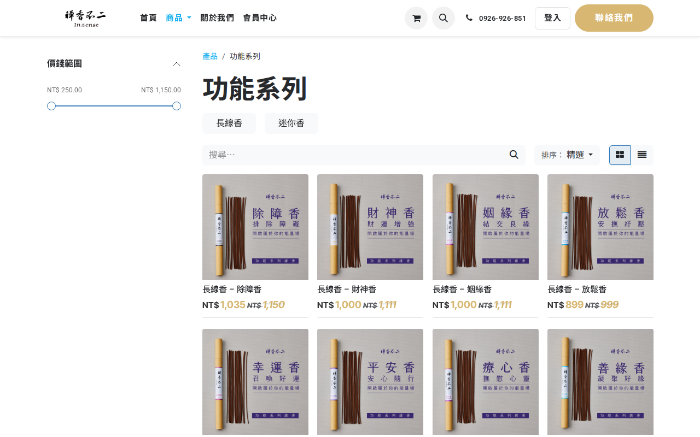
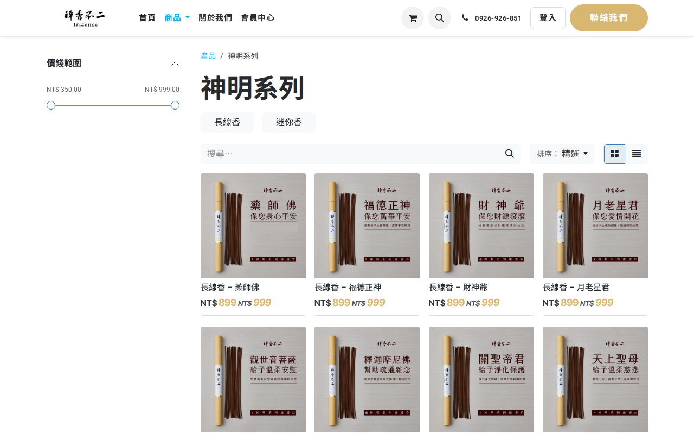
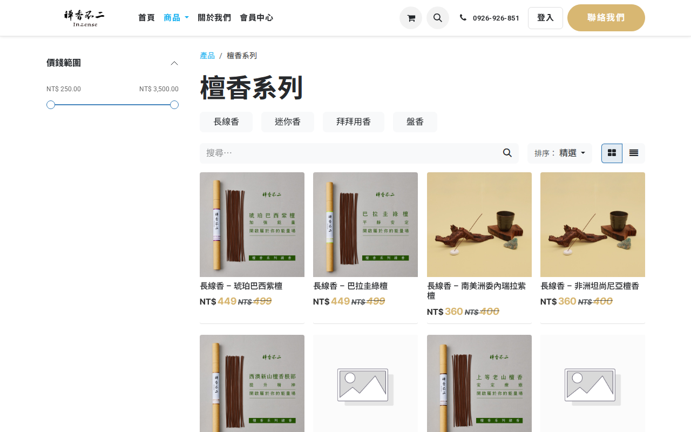
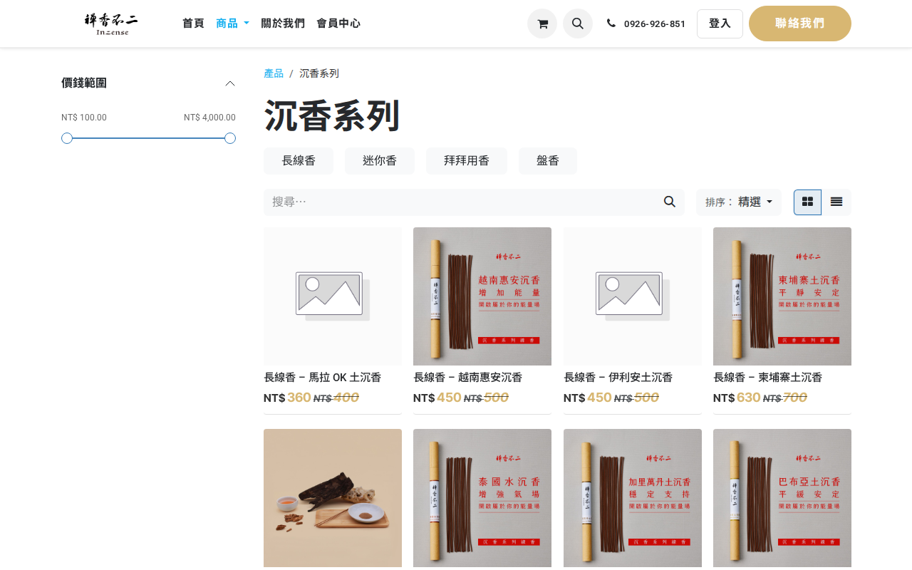

---

## 14. POS 銷售點 — 多門市管理與倉庫隔離

### 14.1 架構說明

```
中和研發製香廠（中央倉庫 / 生產基地）
 ├── 誠品板橋門市倉庫 ← 補貨路線
 ├── 雲彩軒倉庫 ← 補貨路線
 ├── 滿滿倉庫 ← 補貨路線
 ├── 黑橋牌戎館倉庫 ← 補貨路線
 ├── 名品花園倉庫 ← 補貨路線
 ├── 納百川倉庫 ← 補貨路線
 └── 壹品藥局倉庫 ← 補貨路線
```

### 14.2 庫存隔離原則

- 每間門市有**獨立的庫存**，互不影響
- POS 銷售時，**自動從該門市的倉庫扣除庫存**
- 門市之間**不可直接調撥**，必須透過中央倉庫中轉
- 各門市可在後台查看自己倉庫的即時庫存量

### 14.3 內部調撥（補貨）操作

**場景**：中和研發製香廠 → 誠品板橋門市補貨

1. 進入 **庫存** 模組 → **作業** → **調撥**
2. 點擊 **「新增」**
3. 設定：
   - **作業類型**：誠品板橋門市倉庫：內部調撥
   - **來源位置**：中和/庫存
   - **目的位置**：板橋誠品/庫存
4. 在「作業」頁籤加入要調撥的商品與數量
5. 點擊 **「確認」** → 系統建立調撥單
6. 實際出貨後點擊 **「驗證」** 完成調撥
7. 兩邊倉庫的庫存自動更新

---

## 15. POS 銷售點 — 關店與日結

### 15.1 關閉收銀機

1. 在 POS 介面點擊左上角 **「☰」** 漢堡選單
2. 選擇 **「關閉」**
3. 系統顯示日結摘要

### 15.2 日結摘要內容

| 項目 | 說明 |
|------|------|
| 銷售筆數 | 當日完成的訂單數量 |
| 現金收入 | 現金付款總額 |
| 信用卡收入 | 刷卡付款總額 |
| 差異 | 系統金額與實際現金的差異 |
| 總營收 | 當日營業額合計 |

### 15.3 注意事項

- 關店前請確認所有訂單已完成結帳
- 若有暫停中的訂單，需先完成或取消
- 日結後當日 POS 工作階段將關閉，無法再修改當日訂單
- 建議每日營業結束時執行日結

---

## 16. POS 訂單批量匯入

### 16.1 使用場景

當外部銷售平台（如蝦皮、momo、LINE 團購）的訂單需要匯入 POS 系統統一管理時使用。

### 16.2 操作步驟

1. 進入 **銷售點** 模組 → 點擊 **「POS 訂單匯入」**
2. 點擊 **「下載範本」** 取得 CSV/Excel 範本
3. 依照範本格式填入訂單資料
4. 回到匯入頁面，上傳檔案
5. 確認資料預覽無誤後，點擊 **「匯入」**
6. 系統自動建立 POS 訂單，使用「客戶帳戶」作為付款方式

### 16.3 範本欄位說明

| 欄位 | 說明 | 必填 | 範例 |
|------|------|------|------|
| 客戶名稱 | 訂單客戶姓名或公司 | 是 | 王小明 |
| 商品名稱 | 商品完整名稱（需與系統一致） | 是 | 長線香 – 財神香 |
| 數量 | 購買數量 | 是 | 3 |
| 單價 | 商品單價（NT$） | 是 | 350 |
| 訂單日期 | 原始訂單日期 | 否 | 2026-06-15 |

> **注意**：商品名稱必須與 Odoo 系統中的商品名稱完全一致，否則會匯入失敗。

---

## 17. 銷售訂單批量匯入

### 17.1 使用場景

批量建立後台銷售訂單（非 POS），適用於 B2B 批發訂單或經銷商大量下單。

### 17.2 操作步驟

1. 進入 **銷售** 模組
2. 點擊 **「銷售訂單匯入」**
3. 下載範本 → 填入客戶、商品、數量、價格等資料
4. 上傳檔案 → 確認預覽 → 匯入
5. 系統批量建立銷售訂單（草稿狀態）
6. 逐筆確認或批量確認訂單

---

## 18. 銷售訂單完整流程

### 18.1 流程概覽

```
建立報價單 → 確認訂單 → 出貨 → 開立發票 → 收款
  (draft)      (sale)    (done)   (posted)   (paid)
```

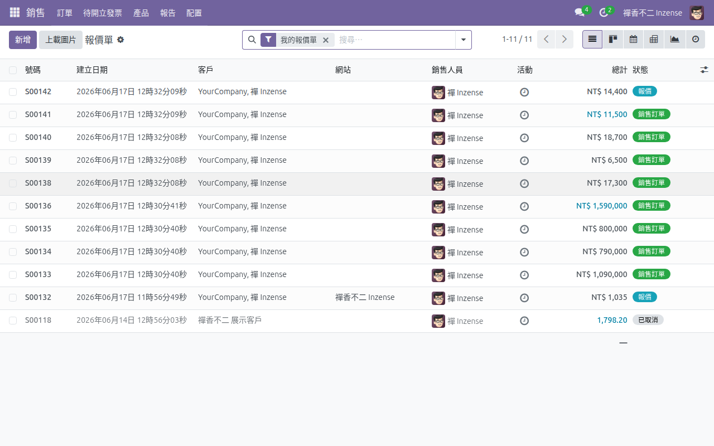

### 18.2 步驟 1：建立報價單

1. 進入 **銷售** 模組 → 點擊 **「新增」**
2. 選擇客戶（從聯絡人中搜尋）
3. 在「訂單明細」頁籤加入商品：
   - 點擊「新增一行」
   - 選擇商品（可搜尋或掃描條碼）
   - 設定數量和單價
4. 確認金額後點擊 **「儲存」**（報價單狀態：草稿）

### 18.3 步驟 2：確認訂單

1. 報價單確認無誤後，點擊 **「確認」** 按鈕
2. 報價單自動轉為「銷售訂單」
3. 系統同時自動建立出貨單（送貨單）

### 18.4 步驟 3：出貨

1. 點擊訂單上方的 **「出貨」** 按鈕（或數字徽章）
2. 進入出貨單頁面
3. 確認出貨商品與數量
4. 點擊 **「驗證」** 完成出貨
5. 出貨單狀態變更為「完成」

### 18.5 步驟 4：開立發票

1. 回到銷售訂單頁面
2. 點擊 **「建立發票」** 按鈕
3. 選擇 **「一般發票」**（依已交付數量）
4. 發票自動建立為草稿狀態
5. 進入發票頁面，確認金額後點擊 **「過帳」**

### 18.6 步驟 5：收款

1. 在已過帳的發票頁面，點擊 **「登記付款」**
2. 選擇付款日記帳（現金/銀行）
3. 確認收款金額
4. 點擊 **「建立付款」**
5. 發票狀態自動變更為 **「已付款」**

---

## 19. 發票管理與銷帳

### 19.1 發票列表

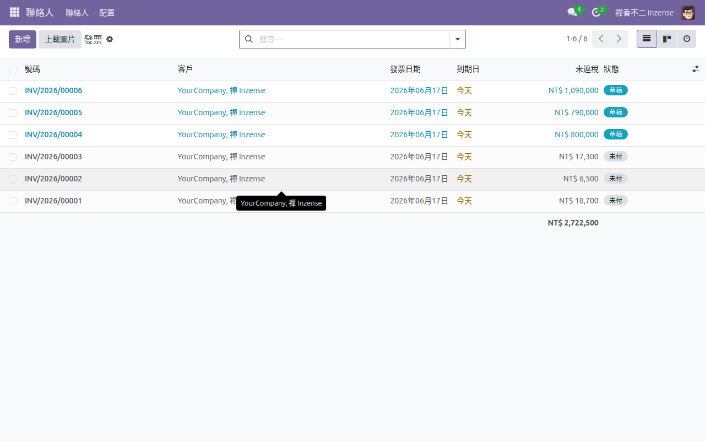

進入 **會計** 模組 → **客戶** → **發票** 查看所有客戶發票。

### 19.2 發票狀態說明

| 狀態 | 說明 | 可執行動作 |
|------|------|---------|
| 草稿 | 發票已建立但未確認 | 編輯、過帳、刪除 |
| 已過帳 | 發票已確認，等待付款 | 登記付款、列印、折讓 |
| 已付款 | 款項已全額收取 | 列印、查看付款紀錄 |
| 已取消 | 發票已作廢 | — |

### 19.3 登記付款

1. 開啟一張「已過帳」狀態的發票
2. 點擊 **「登記付款」** 按鈕
3. 設定：
   - **日記帳**：選擇銀行或現金
   - **付款日期**：收款日期
   - **金額**：收款金額（預設為發票全額）
4. 點擊 **「建立付款」**
5. 發票自動標記為「已付款」

### 19.4 折讓單（貸項通知）

若需退款或折讓：

1. 開啟原始發票
2. 點擊 **「折讓單」** 按鈕
3. 選擇折讓原因和方式：
   - **部分折讓**：指定折讓金額
   - **全額折讓**：沖銷整張發票
4. 確認後自動建立折讓單
5. 過帳折讓單完成沖銷

---

## 20. 後台管理 — 登入與儀表板

### 20.1 登入後台

1. 前往 `https://inzense-odoo.woowtech.io/web/login`
2. 使用員工帳號（如 `fireshadow131@gmail.com`）登入
3. 進入 Odoo 後台管理介面

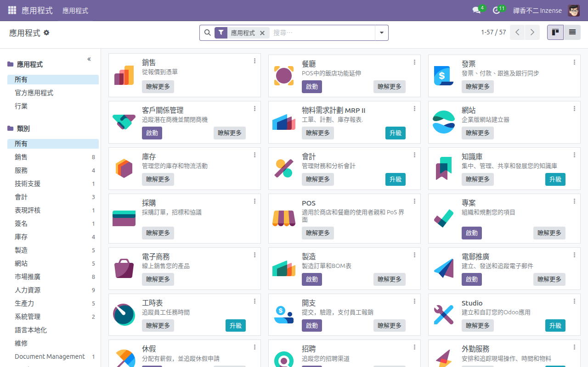

### 20.2 主要模組導航

| 模組 | 功能說明 |
|------|---------|
| 銷售 | 報價單、銷售訂單、客戶管理 |
| 銷售點（POS） | 7 間門市 POS 管理 |
| 會計 | 發票、收款、日記帳、報表 |
| 庫存 | 8 倉庫管理、調撥、盤點 |
| CRM | 客戶線索、商機管道 |
| 聯絡人 | 客戶/供應商/合作夥伴資料 |
| 網站 | 前台電商網站管理 |
| 設定 | 系統設定、使用者管理、模組管理 |

### 20.3 使用者管理

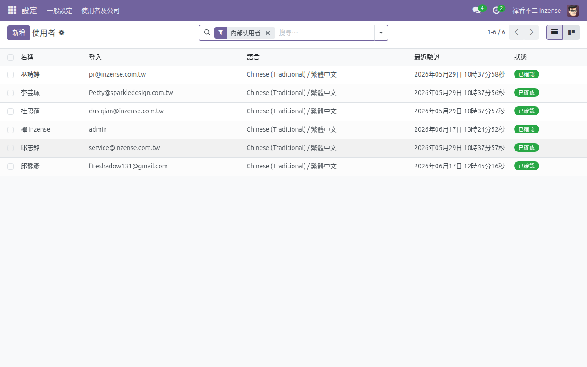

進入 **設定** → **使用者與公司** → **使用者** 可管理所有帳號。

**新增使用者**：
1. 點擊 **「新增」**
2. 填寫：姓名、Email（作為登入帳號）
3. 設定權限群組（銷售/庫存/POS/會計等）
4. 儲存後系統發送邀請信

---

## 21. 後台管理 — 產品目錄管理

### 21.1 產品列表

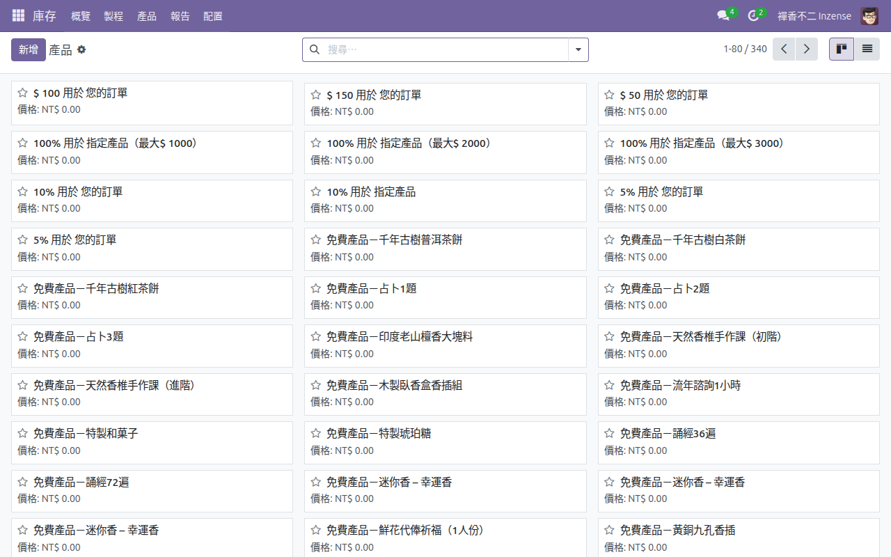

進入 **庫存** → **產品** → **產品** 查看所有商品。

- 目前共 **306 項商品**（其中 **293 項已上架**）
- 13 項原木系列以克計價商品設為未上架

### 21.2 新增商品

1. 點擊 **「新增」**
2. 填寫基本資訊：
   - **商品名稱**：繁體中文名稱（如「長線香 – 財神香」）
   - **銷售價格**：NT$ 定價
   - **商品類型**：「可庫存品」（需追蹤庫存）或「消耗品」
   - **內部參考**：內部編號
   - **條碼**：EAN-13 或自訂條碼
3. **銷售頁籤**：
   - 客戶稅：選擇「營業稅 5%」
4. **庫存頁籤**：
   - 追蹤方式：依商品需求設定
5. 點擊 **「儲存」**

### 21.3 上架到電商網站

1. 開啟商品頁面
2. 點擊 **「前往網站」** 按鈕
3. 在網站編輯器中設定商品圖片和描述
4. 點擊 **「發布」** 完成上架
5. 商品即在前台商店頁面顯示

### 21.4 POS 分類設定

1. 進入 **銷售點** → **設定** → **POS 產品類別**
2. 點擊 **「新增」** 建立分類（如：功能系列）
3. 可設定父分類建立階層
4. 在商品頁面的 POS 分類欄位指定分類

---

## 22. 後台管理 — 庫存與倉庫管理

### 22.1 倉庫列表

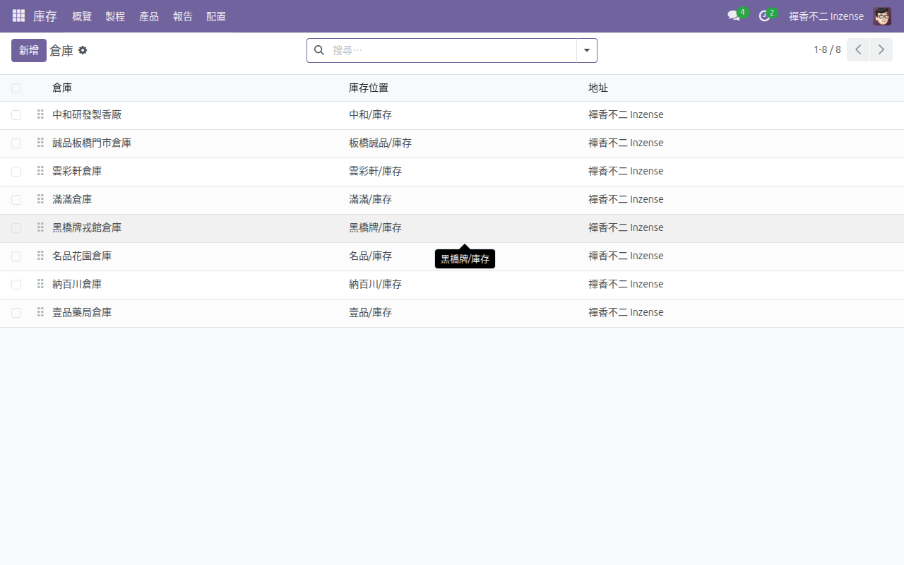

目前 **8 個活躍倉庫**（1 中央 + 7 門市）：

| 倉庫 | 代碼 | 用途 |
|------|------|------|
| 中和研發製香廠 | 中和 | 中央倉庫 / 生產基地 / 配貨中心 |
| 誠品板橋門市倉庫 | 板橋誠品 | 誠品板橋寄賣庫存 |
| 雲彩軒倉庫 | 雲彩軒 | 雲彩軒寄賣庫存 |
| 滿滿倉庫 | 滿滿 | 滿滿寄賣庫存 |
| 黑橋牌戎館倉庫 | 黑橋牌 | 黑橋牌戎館寄賣庫存 |
| 名品花園倉庫 | 名品 | 名品花園寄賣庫存 |
| 納百川倉庫 | 納百川 | 納百川寄賣庫存 |
| 壹品藥局倉庫 | 壹品 | 壹品藥局寄賣庫存 |

### 22.2 庫存總覽

進入 **庫存** 模組首頁可查看：
- **總覽**：各倉庫的待處理作業（收貨、出貨、內部調撥）
- **產品**：每項商品在各倉庫的即時庫存量

### 22.3 內部調撥（補貨操作）

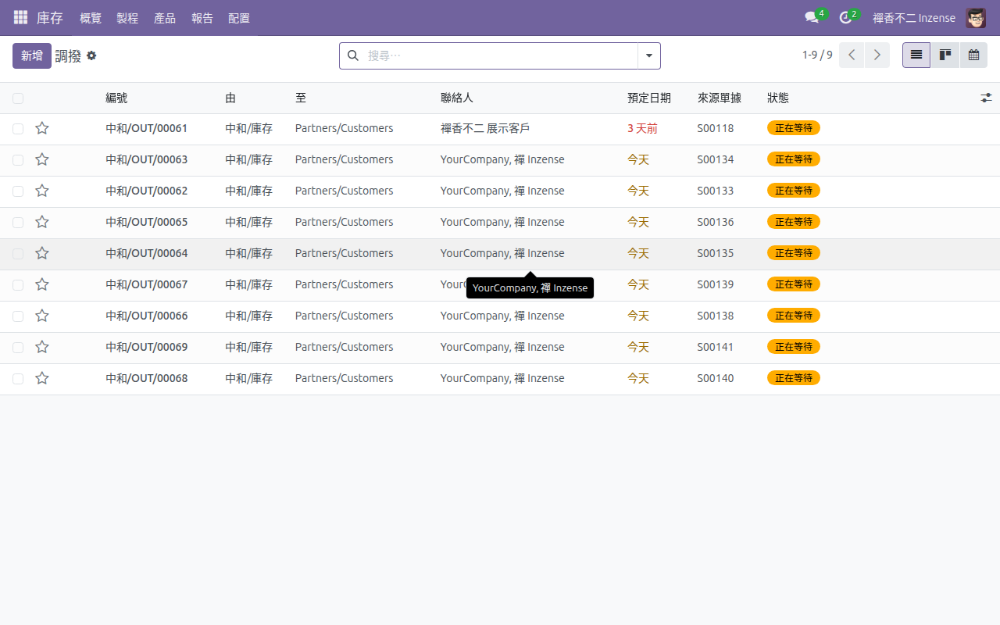

**操作步驟**（從中央補貨到門市）：

1. **庫存** → **作業** → **調撥** → **「新增」**
2. 設定作業類型：選擇目標倉庫的「內部調撥」
3. 來源位置：`中和/庫存`
4. 目的位置：`板橋誠品/庫存`（或其他門市）
5. 在「作業」頁籤加入要調撥的商品與數量
6. 點擊 **「確認」** → 出庫後點擊 **「驗證」**

### 22.4 庫存盤點

1. **庫存** → **作業** → **實際盤點**
2. 點擊 **「新增」** 或直接修改數量
3. 選擇盤點位置（指定倉庫）
4. 逐一輸入各商品的實際數量
5. 系統自動計算帳面數量與實際數量的差異
6. 點擊 **「套用全部」** 更新庫存

---

## 23. 後台管理 — 忠誠計畫管理

### 23.1 忠誠計畫列表


### 23.2 目前啟用的計畫

| 計畫名稱 | 類型 | 點數單位 | 說明 |
|---------|------|---------|------|
| 誠品板橋-品牌集點卡 | 集點 | 點 | 消費累積點數 |
| 禪香不二 禮品卡 | 禮品卡 | 元 | 儲值禮品卡 |
| 禪香不二 電子錢包 | 電子錢包 | 元 | 線上餘額 |
| 迷你香任選3盒900 | 促銷 | — | 迷你香組合優惠 |
| 年中慶-滿千贈黃銅香插 | 促銷 | — | 滿額贈品 |
| 轉盤-95折券 | 優惠券 | 張 | 全單 95 折 |
| 轉盤-現折100 | 優惠券 | 張 | 現折 NT$100 |
| 轉盤-現折50 | 優惠券 | 張 | 現折 NT$50 |
| 轉盤-免費贈品券 | 優惠券 | 張 | 免費兌換贈品 |
| 滿額贈（4 階） | 優惠券 | 張 | NT$3,800-12,800 滿額贈 |

### 23.3 新增忠誠計畫

1. 進入 **銷售** → **忠誠計畫** → **「新增」**
2. 選擇計畫類型：
   - **集點卡**：消費累積點數
   - **優惠券**：折扣券發放
   - **禮品卡**：儲值卡
   - **電子錢包**：線上錢包
   - **促銷**：自動套用的優惠規則
3. 設定「規則」（觸發條件）和「獎勵」（折扣方式）
4. 開啟 **「Portal 可見」** 讓會員在會員中心看到
5. 設定 **「點數名稱」**（點 / 張 / 元）
6. 儲存並啟用

### 23.4 發放優惠券給會員

1. 進入忠誠計畫 → 點擊 **「產生優惠券」**
2. 選擇目標客戶或客戶群組
3. 設定數量和有效期限
4. 確認發放

---

## 24. 後台管理 — 客戶與權限管理

### 24.1 聯絡人管理

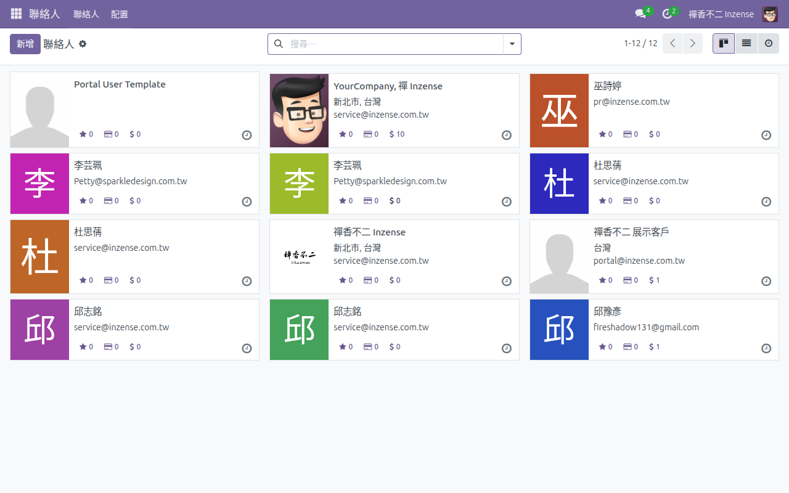

進入 **聯絡人** 模組管理客戶與合作夥伴。

### 24.2 新增客戶

1. 點擊 **「新增」**
2. 填寫基本資訊：
   - 姓名（或公司名稱）
   - Email
   - 電話
   - 地址
3. 國家選擇：**台灣**
4. 點擊 **「儲存」**

### 24.3 授予 Portal（會員）權限

讓客戶可以登入會員中心查看訂單和忠誠計畫：

1. 開啟客戶的聯絡人頁面
2. 點擊上方 **「動作」** 下拉選單
3. 選擇 **「授予 Portal 存取權」**
4. 系統自動發送邀請信至客戶的 Email
5. 客戶點擊信中的連結設定密碼
6. 完成後即可使用 Email 登入會員中心

### 24.4 使用者權限等級

| 權限等級 | 說明 | 適用對象 |
|---------|------|---------|
| 管理員 | 所有模組完整存取權限 | 邱豫彥、李芸珮 |
| 內部使用者 | 操作權限，不可更改系統設定 | 邱志銘、杜思蒨、巫詩婷 |
| Portal（會員） | 僅能存取會員中心前台 | 一般客戶/會員 |

---

## 25. 後台管理 — 條碼掃描功能

### 25.1 功能說明

系統整合 WOOWTECH 條碼掃描模組，支援以下場景：

| 場景 | 模組 | 功能 |
|------|------|------|
| POS 收銀 | barcode_scanner_pos | 掃描商品條碼加入購物車 |
| 銷售訂單 | barcode_scanner_sale | 掃描條碼加入訂單明細 |
| 庫存管理 | barcode_scanner_stock | 掃描條碼查詢/調撥庫存 |
| 發票 | barcode_scanner_account | 掃描條碼加入發票明細 |

### 25.2 條碼格式

| 格式 | 說明 | 範例 |
|------|------|------|
| EAN-13 | 13 位國際條碼 | 4710001234567 |
| GS1-128 | 含批號/效期的進階條碼 | (01)04710001234567(10)LOT001 |
| 自訂條碼 | 公司內部條碼 | INZ-FUN-001 |

### 25.3 POS 掃描操作

1. 在 POS 介面，將游標放在搜尋欄
2. 使用條碼掃描器掃描商品
3. 系統自動搜尋匹配的商品並加入購物車
4. 重複掃描同一商品會自動增加數量

### 25.4 標籤列印

1. 進入商品頁面
2. 點擊 **「列印」** → **「商品標籤」**
3. 選擇標籤格式和數量
4. 列印條碼標籤貼在商品上

---

## 26. 行動裝置操作指南

### 26.1 手機瀏覽

所有頁面均支援行動裝置自適應（RWD），自動調整版面。

| 頁面 | 截圖 |
|------|------|
| 首頁 | 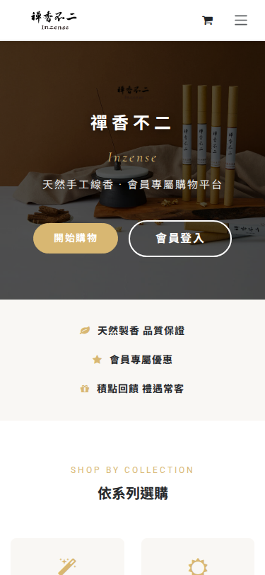 |
| 商店 | 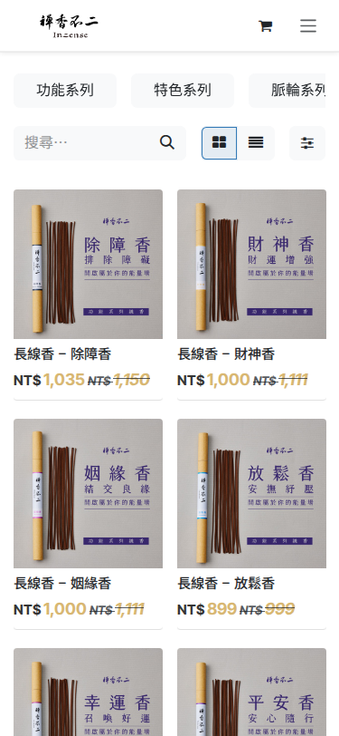 |
| 登入 | 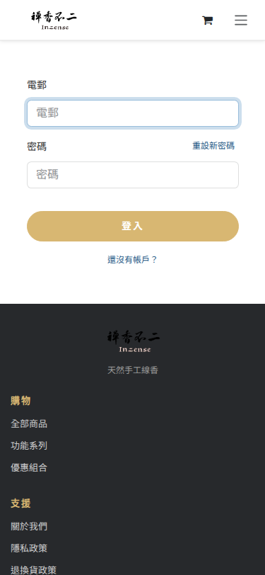 |
| 會員中心 | 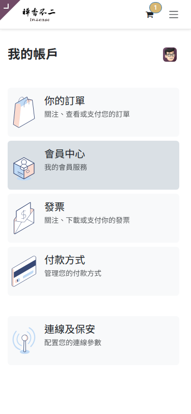 |
| 訂單 | 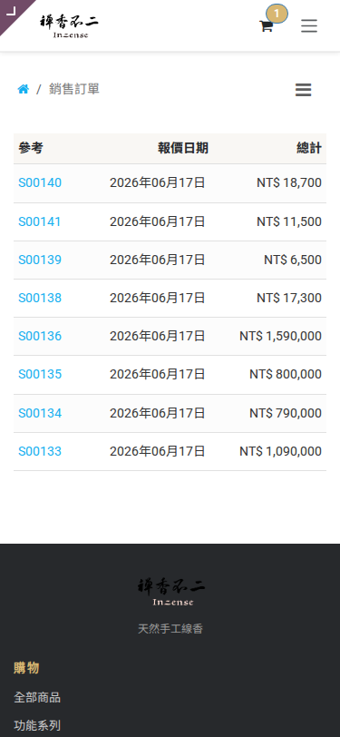 |

### 26.2 手機選單操作

點擊右上角 **「☰」** 漢堡圖示展開選單：
- 首頁
- 商品（含分類下拉選單）
- 關於我們
- 會員中心

### 26.3 POS 平板建議

- POS 系統建議使用 **10 吋以上平板**操作
- 建議使用**橫向顯示**以獲得最佳操作體驗
- 可搭配藍牙條碼掃描器和收據印表機

---

## 27. 前台電商網站操作

### 27.1 首頁

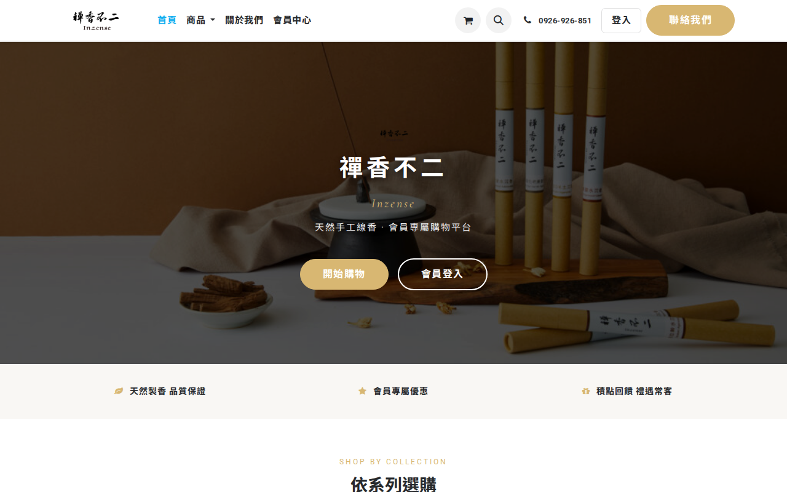

**首頁完整頁面（含全部五個區塊）**：

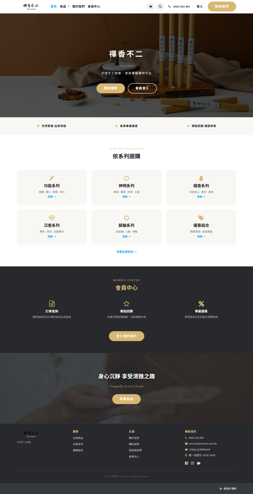

首頁包含五個區塊：

| 區塊 | 內容 |
|------|------|
| Hero 品牌形象 | 品牌名稱 + Logo + 雙 CTA（開始購物 / 會員登入） |
| 價值條 | 天然製香品質保證 / 會員專屬優惠 / 積點回饋禮遇常客 |
| 分類導航 | 6 大系列快速入口（功能/神明/檀香/沉香/脈輪/優惠組合） |
| 會員中心 | 訂單查詢 / 集點回饋 / 專屬優惠 + 登入 CTA |
| 結尾 CTA | 品牌意象 + 探索商品按鈕 |

### 27.2 商品瀏覽

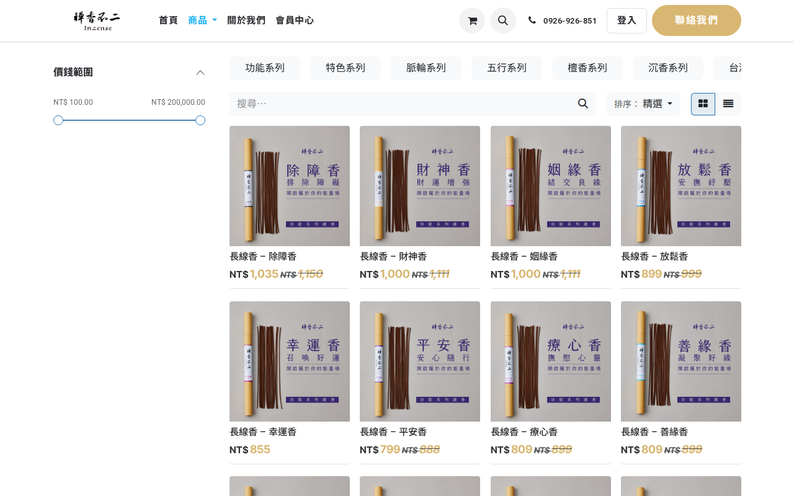

**完整商店頁面（含分類側邊欄）**：

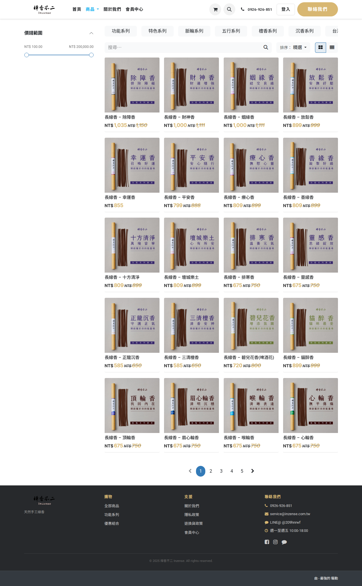

- **左側**：分類篩選欄（19 大分類可展開）
- **右側**：商品卡片（圖片、名稱、NT$ 價格）
- 支援關鍵字搜尋和價格排序

### 27.3 線上購物流程

1. 瀏覽商品 → 點擊 **「加入購物車」**
2. 點擊右上角購物車圖示 → 確認商品和數量
3. 點擊 **「前往結帳」**
4. 填寫或確認配送資訊
5. 輸入優惠券代碼（若有）
6. 選擇付款方式
7. 確認下單

### 27.4 關於我們

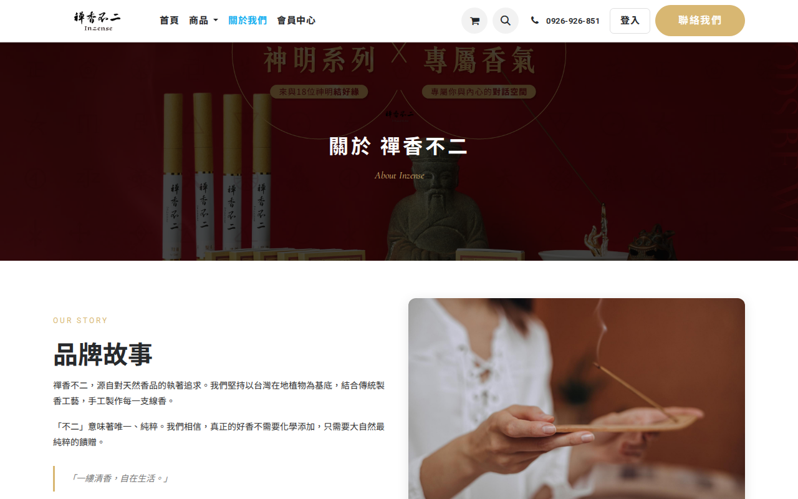

**關於我們完整頁面（品牌故事 + 聯絡資訊 + CRM 表單 + 服務項目）**：

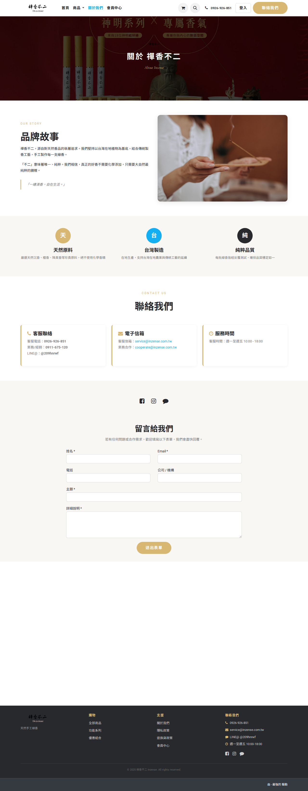

整合頁面包含：
- 品牌故事（「不二」意味著唯一、純粹）
- 三大理念：天然原料 / 台灣製造 / 純粹品質
- 聯絡資訊卡片（客服電話、Email、服務時間）
- **CRM 留言表單**（提交後自動建立 CRM 線索）
- 服務項目（經銷通路、配方研發、手作課程）
- 公司地址與社群連結

### 27.5 聯絡我們

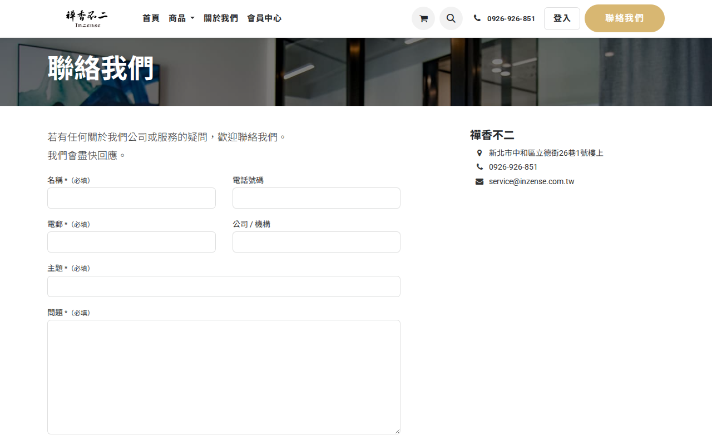

**聯絡我們完整頁面**：

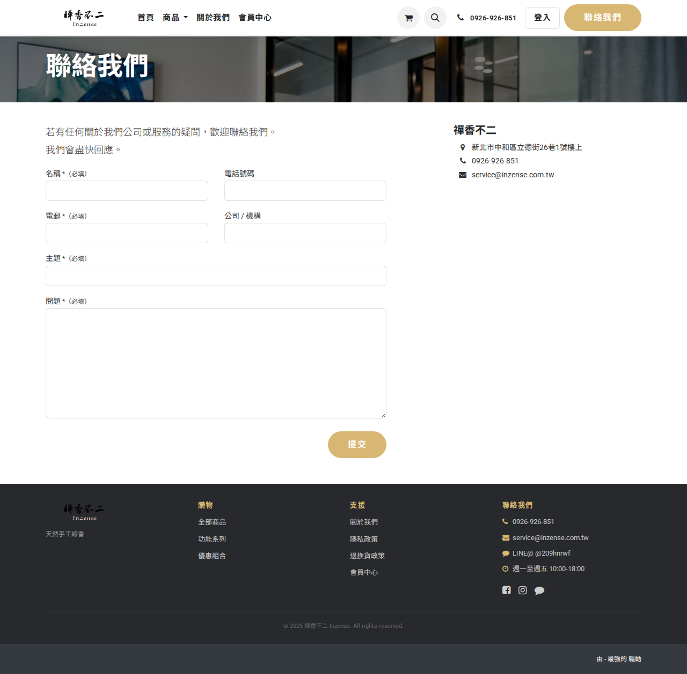

### 27.6 其他頁面

| 頁面 | 路徑 | 說明 |
|------|------|------|
| 隱私政策 | `/privacy-policy` | 個資蒐集、使用、保護說明 |
| 退換貨政策 | `/return-policy` | 7天鑑賞期（消保法第19條）、退貨條件、退款方式 |
| 聯絡我們 | `/contactus` | 聯絡表單（提交後自動建立 CRM 線索） |

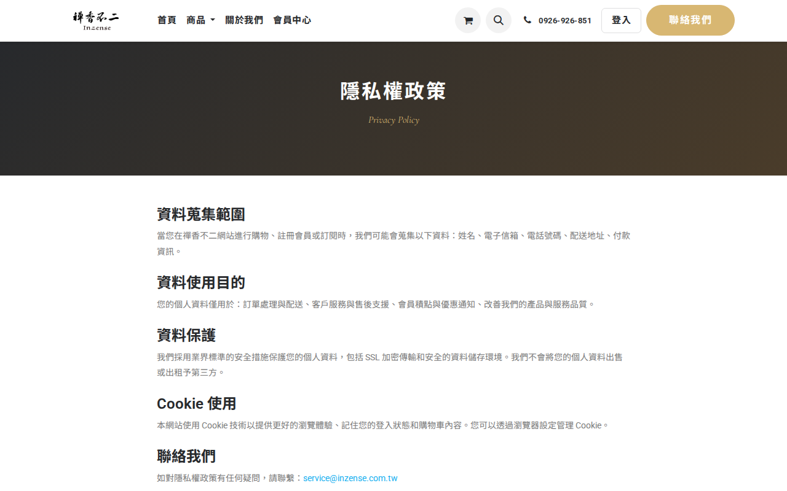
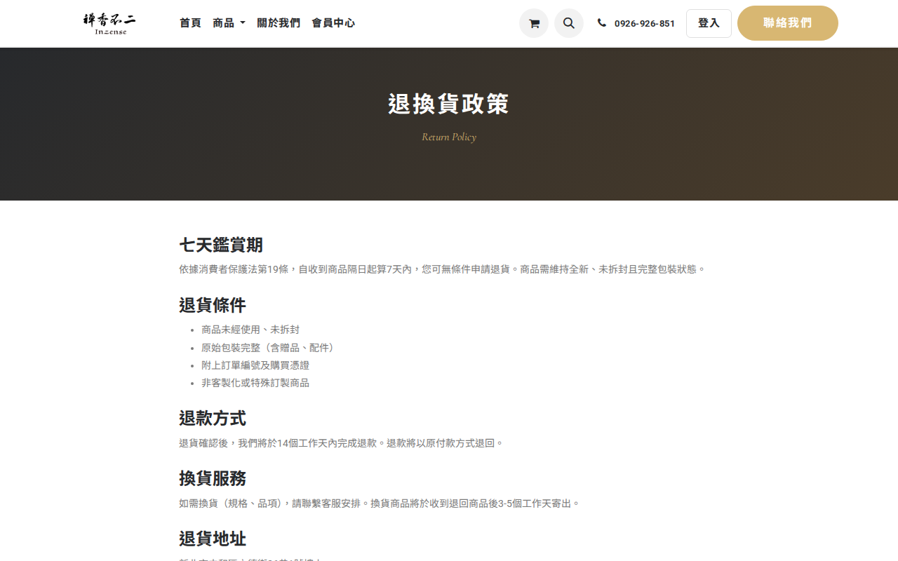

### 27.7 頁尾（Footer）

頁尾採四欄式佈局：
1. **品牌** — Logo + 「天然手工線香」
2. **購物** — 全部商品 / 功能系列 / 優惠組合
3. **支援** — 關於我們 / 隱私政策 / 退換貨政策 / 會員中心
4. **聯絡我們** — 電話 / Email / LINE@ / 服務時間 / 社群圖示

---

## 28. CRM 客戶關係管理

### 28.1 CRM 流程

```
聯絡表單提交 → 自動建立線索 → 商機評估 → 報價 → 成交
```

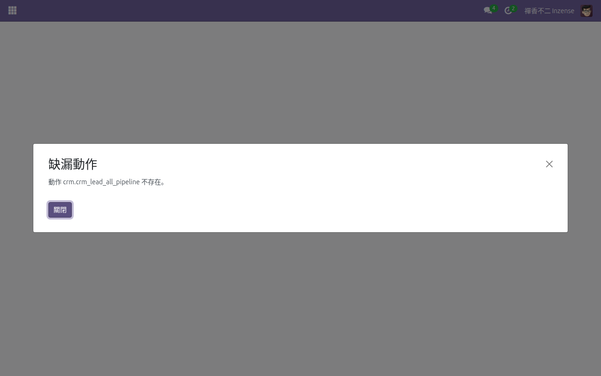

### 28.2 線索來源

| 來源 | 說明 | 自動/手動 |
|------|------|---------|
| 網站聯絡表單 | `/contactus` 和 `/about-us` 的留言表單 | 自動建立 |
| 手動建立 | 後台手動新增線索 | 手動 |
| Email | 客戶來信（需設定收信伺服器） | 自動 |

### 28.3 網站表單 → CRM 線索

當客戶在前台「關於我們」或「聯絡我們」頁面提交留言表單：

1. 客戶填寫：姓名、Email、電話、公司、主題、說明
2. 點擊 **「送出表單」**
3. 系統自動在 CRM 模組建立一筆線索（Opportunity）
4. 線索出現在 CRM Pipeline 的「新」欄
5. 指定負責人跟進處理

### 28.4 線索處理流程

1. 進入 **CRM** 模組
2. 新線索出現在管道的「新」欄
3. 點擊線索查看客戶資訊和留言內容
4. 依進度拖曳到對應階段：
   - **新** → **已聯繫** → **評估中** → **提案** → **成交**
5. 可直接從線索建立報價單（銷售訂單）

---

## 29. 常見問題（FAQ）

### Q1：忘記密碼怎麼辦？
在登入頁面點擊「重設密碼」，輸入 Email 後收取重設連結。若未收到，請聯繫管理員。

### Q2：POS 結帳時找不到客戶？
確認客戶已在「聯絡人」模組中建立，且帳號狀態為啟用。可在 POS 搜尋欄輸入客戶名稱或電話搜尋。

### Q3：商品庫存數量不對？
進入 **庫存** → **產品** 選擇商品，查看「手上」數量。若有差異，使用「實際盤點」功能調整。

### Q4：如何查看特定門市的銷售報表？
進入 **銷售點** → **訂單** → 使用篩選器選擇特定門市（POS 配置）。

### Q5：優惠券無法使用？
請確認：(1) 優惠券未過期 (2) 已在 POS 中選擇客戶 (3) 訂單金額符合使用條件。

### Q6：如何從中央倉庫補貨到門市？
進入 **庫存** → **調撥** → 新增內部調撥，設定來源（中和/庫存）和目的（門市/庫存）。詳見 [第14章](#14-pos-銷售點--多門市管理與倉庫隔離)。

### Q7：發票如何作廢？
開啟發票 → 點擊「折讓單」建立沖銷發票。已過帳的發票不可直接刪除，只能透過折讓單沖銷。

### Q8：客戶要求月結怎麼處理？
POS 結帳時選擇「客戶帳戶」付款方式（需先指定客戶），月底再透過後台統一建立發票和收款。

### Q9：如何新增門市員工帳號？
**設定** → **使用者** → **新增** → 填寫姓名和 Email → 設定權限群組（POS/庫存/銷售）→ 儲存。

### Q10：網站上的聯絡表單送到哪裡？
送到 **CRM** 模組，自動建立線索（Opportunity）。在 CRM Pipeline 中查看和處理。詳見 [第28章](#28-crm-客戶關係管理)。

### Q11：如何在電商網站上架新商品？
在後台商品頁面點擊「前往網站」→ 設定圖片和描述 → 點擊「發布」。詳見 [第21章](#21-後台管理--產品目錄管理)。

### Q12：禮品卡和電子錢包有什麼不同？
禮品卡有到期日且可贈送給他人（有代碼）；電子錢包綁定個人帳號、永久有效，類似儲值帳戶。

---

## 30. 系統管理與維護

### 30.1 系統資訊

| 項目 | 說明 |
|------|------|
| 平台 | Odoo 18 Community |
| 部署 | K3s (Kubernetes) + Cloudflare Tunnel |
| 資料庫 | PostgreSQL 16 |
| 語言 | 繁體中文 (zh_TW) |
| 幣別 | TWD (新台幣)，無小數位 |
| 時區 | Asia/Taipei |
| 稅務 | 營業稅 5% / 進項稅 5% |
| 會計模組 | l10n_tw（台灣在地化） |

### 30.2 定期維護事項

| 頻率 | 事項 | 負責人 | 說明 |
|------|------|--------|------|
| 每日 | POS 日結 | 門市員工 | 各門市收銀機關閉時執行 |
| 每週 | 庫存檢查 | 邱志銘 | 確認各門市庫存充足，安排補貨 |
| 每月 | 發票對帳 | 李芸珮 | 確認所有發票已收款 |
| 每月 | 備份檢查 | 系統管理 | 確認資料庫備份正常 |
| 每季 | 忠誠計畫審查 | 邱豫彥 | 檢視優惠券到期狀況，規劃新活動 |
| 每季 | 密碼更新 | 全體員工 | 定期更換登入密碼 |

### 30.3 技術支援

如遇系統問題，請聯繫：

| 項目 | 聯絡方式 |
|------|---------|
| 系統維護團隊 | WOOW Tech 沃科技 |
| 技術信箱 | （請洽 WOOW Tech） |
| 客服信箱 | service@inzense.com.tw |
| 業務電話 | 0911-675-120 |

### 30.4 緊急處理

| 狀況 | 處理方式 |
|------|---------|
| 系統無法登入 | 確認網路連線 → 清除瀏覽器快取 → 聯繫 WOOW Tech |
| POS 無法開啟 | 確認網路 → 重新整理頁面 → 聯繫 WOOW Tech |
| 庫存數據異常 | 停止操作 → 記錄問題 → 聯繫管理員處理 |
| 網站無法存取 | 確認 Cloudflare 狀態 → 聯繫 WOOW Tech |

---

> **版權聲明**：本手冊由 WOOW Tech 沃科技 製作維護，僅供禪香不二 Inzense 內部培訓使用。
>
> **最後更新**：2026-06-17 | **版本**：v2.0
